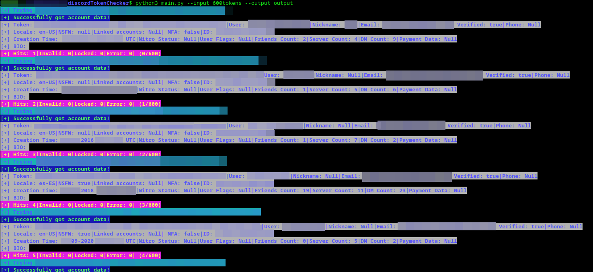
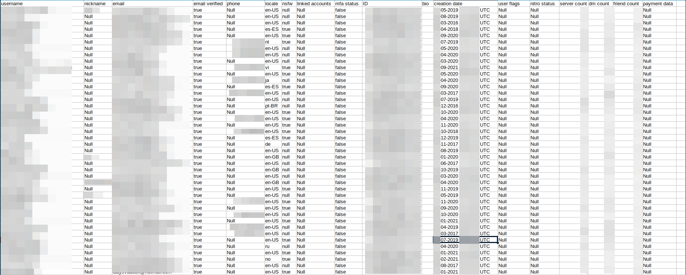

## LEGAL DISCLAIMER:
THIS PROGRAM IS ONLY ALLOWED FOR LEGAL USE, ANY USAGE WHICH CAN BE CONSIDERED ILLEGAL IS FORBIDDEN BY THE CREATOR AND THEY ARE NOT RESPONSIBLE FOR ANY DAMAGE THAT MAY OCCUR; THIS MAY INCLUDE USING STOLEN TOKENS WHICH IS FOBIDDEN

# Dicord Token Checker cli V1.2.0 

Simple script made in python to check discord tokens for account data(total of 10 data points) and write it in csv format

Unlike other programs there are no 3rd party dependencies required; just python3 and a working internet connection

## Checksums:
This is the checksum for `main.py`

These will be updated with every release

MD5: `199dd15cac53d61114adc4639c000b2a`

SHA1: `8a1652536b2b8d601127d4ff28a35a9b60847636`

SHA256: `f9861e06385feed2bd5474d5b5311d2caf04a82cab4701883d52ba927f23e929`

## Install:
Download `main.py`

## Usage:
Example usage `python3 main.py --input input.txt --output.txt`

Use argument `-i` or `--input` to specifiy your input file(required)

Format should be 1 token per line, e.g:

- token0
- token1
- token2
- token3
- token4
- token5

Use argument `-o` or `--output` to specifiy your output file(required, output is .csv format)

The information we can get from discord with just a token is the following:

- token (string)
- username (string)
- discriminator (string)
- nickname (string)
- email (string)
- email verified (bool)
- phone (string)
- locale (string)
- nsfw (bool)
- linked accounts (array)
- mfa status (bool)
- ID (int)
- bio (string)
- creation date (string)
- user flags (string)
- nitro status (string)
- server count (int)
- dm count (int)
- friend count (int)
- payment data (bool)

## V2.0.0 UPDATE!
The second minor release is here with some new features:
- Efficiency upgrades
- Colours
- Clearing output
- Bug fixes
- Creation Date
- Server Count
- DM Count
- Friend Count
- Payment Data

## Planned Features:
- Payment Information
- Save Avatars
- bug fixes

## Bugs:
please report all bugs you find, i will append the github accounts of everyone who finds bug's or makes improvements.

## Hall of bug hunters:
- EmptyGateAhead
