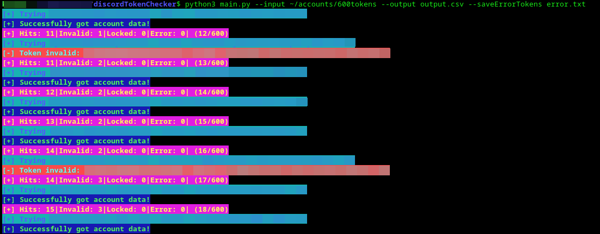
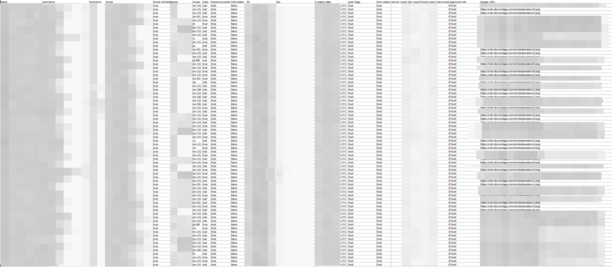
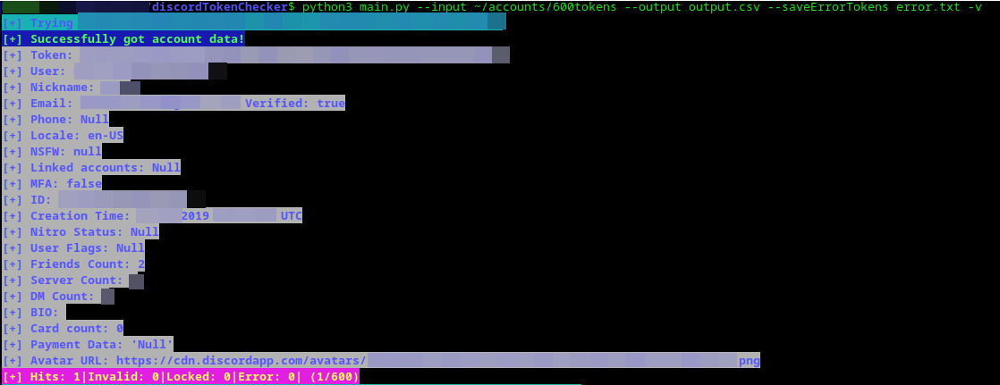
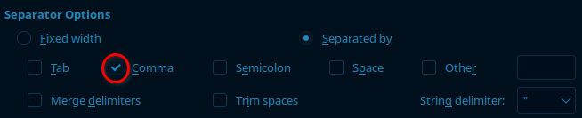
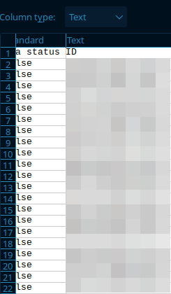

### LEGAL DISCLAIMER:
THIS PROGRAM IS ONLY ALLOWED FOR LEGAL USE, ANY USAGE WHICH CAN BE CONSIDERED ILLEGAL IS FORBIDDEN BY THE CREATOR AND THEY ARE NOT RESPONSIBLE FOR ANY DAMAGE THAT MAY OCCUR; THIS MAY INCLUDE USING STOLEN TOKENS WHICH IS FOBIDDEN

# Dicord Token Checker cli V3.0.0 

Simple script made in python to check discord tokens for account data(total of 21 data points) and write it in csv format

Unlike other programs there are no 3rd party dependencies required; just python3 a working internet connection and something to view csv data(libre office is recommended)

## Checksums:

└MD5: `def7e1c83e49a92941c420f1ea512006`

└SHA1: `88ddfe4f16300264086460f00a273b7e5d7f7bfc`

└SHA256: `f7ecffe24cc0175adeef2fb7cf70c0390d0cfe498e79461dbcfd65daa43412c2`

## Install:
Download `main.py` from [releases](https://github.com/EmptyGateAhead/discordTokenCheckerCLI/releases)

## Arguments:
Syntax E.G: `python3 main.py --input 600tokens --split : 2 --output output.csv  --avatars avatars/run1 --saveErrorTokens error.txt -v`

This can be shortened to: `python3 main.py -i 600tokens -s : 2 -o output.csv -a avatars/run2 -se error.txt -v`

For normal operation you do not need to use all of the above arguments

using just the required arguments: `python3 main.py -i 600tokens -o output.csv`

### Input:

`-i` or `--input` specifies your input file(required)

Format should be 1 token per line, e.g:

- token0
- token1
- token2
- token3
- token4
- token5

### Output:

`-o` or `--output` specifies your output file(required, output is csv format)

Columns:

token,username,nickname,email,email verified,phone,locale,nsfw,linked accounts,mfa status,ID,bio,creation date,user flags,nitro status,server count,dm count,friend count,card count,payment info,avatar URL

### Split:

If you have a file with a different layout you can use `--split`(optional)

- mail:pass:token0
- mail:pass:token1
- mail:pass:token2
- mail:pass:token3
- mail:pass:token4
- mail:pass:token5

For a file with a layout like the one above you would use `--split : 2` or `-s : 2`

this specifies to split the line at the : character and then 2 specifies the tokens position

### Avatar:

`-a` or `--avatar` saves the users avatars locally(optional)

Specify the directory to save the avatars to, if the directory does not exist then the program will automatically create one

### Invalid/Locked tokens:

`-se` or `--saveErrorTokens` can be used to save invalid and locked tokens to a seperate file

### Verbose

`-v` or `--verbose` will output more information when the program is running

## CSV configurations:

due to the fact some users bio's may have characters like semicolons and other characters that mess with the layout

it is important to set it up to only seperate columns on the comma character, i recommend using libre office as that is what i am using.

Its also recommended to set the ID column as text

## Data:
The information we can get from a valid discord token:

- token (string)
- username (string)
- discriminator (string)
- nickname (string)
- email (string)
- email verified (boolean)
- phone (string)
- locale (string)
- nsfw (boolean)
- linked accounts (array)
- mfa status (boolean)
- ID (interger)
- bio (string)
- creation date (string)
- user flags (string)
- nitro status (string)
- server count (interger)
- dm count (interger)
- friend count (interger)
- payment data(array)
- avatar URL(string)

## V3.0.0 UPDATE!
- Detailed payment data
- Verbose argument
- Avatars
- Split position and characters

## Planned Features:
after some thinking i will be ditching any http client and instead i will be re writing this to use pure sockets instead.
the speed improvements will be much better and the code will be more efficient

## Bugs:
please report all bugs you find, i will append the github accounts of anyone who finds bug's or makes improvements.

## Hall of bug hunters:
- EmptyGateAhead
