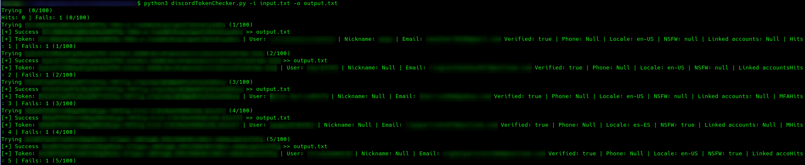

# Dicord Token Checker cli

Simple script made in python to check discord tokens for account data(total of 10 data points)

Unlike other programs there are no 3rd party dependencies required; just python3 and a working internet connection
## Install 
Download discordTokenChecker.py

## Usage
Use argument `-i` or `--input` to specifiy your input file(required)

Format should be 1 token per line, e.g:

- token0
- token1
- token2
- token3
- token4
- token5

Use argument `-o` or `--output` to specifiy your output file(required, output is .csv format)

Example usage: `python3 discordTokenChecker.py --input input.txt --output.txt`

The information we can get from discord with just a token is the following: 

- token
- username
- nickname
- email
- emailVerified
- phone
- locale
- nsfw
- linkedAccounts
- mfaStatus
- ID
- bio
